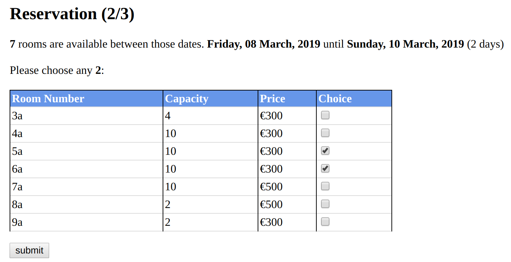
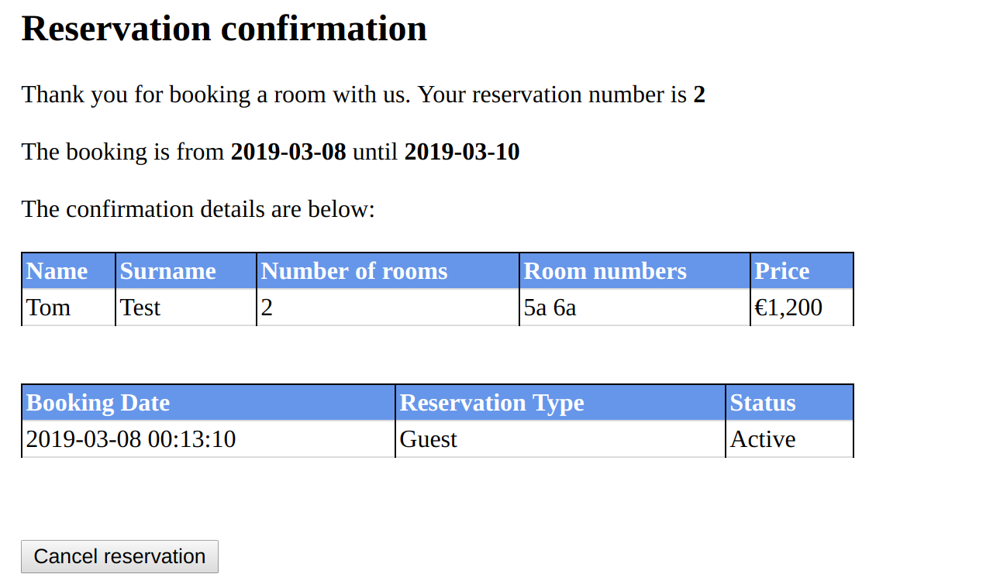

## Description

This is a web application for a hotel reservation system.

## Database setup

**Linux**:

Log into MySQL from this repository's root directory (username root) `mysql -u root -p`

Create a database called sse `CREATE database sse;`

Execute the included SQL file to create the webApp's tables `source docs/db/createTables.sql;`

## Project Trello board

This is effectively a diary that documents the contribution of each team member to the project.
<https://trello.com/invite/b/3rONPJFY/b6924afd4c73865357ae565eb06815da/hotelwebapp>

## Java External dependencies

JavaServer Pages Standard Tag Library - javax.servlet.jsp.jstl

JavaServer Pages Standard Tag Library API - javax.servlet.jsp.jstl-api

MySQL Connector/J (the official JDBC driver for MySQL) - mysql-connector-java

## Functionality

The following functionality was implemented:

- Show available rooms: users should be able to view rooms that are available between specific dates and for a certain number of guests.
 
- Guest users can book one or more available rooms. Allow users to  book available rooms as guests. To do so each user should provide his/her personal details (name, surname, address, phone number, email address). When booking a room a user will be required to provide his/her credit card number to terminate the booking.
 
- Guest users can retrieve their past reservations. Guest users should be able to retrieve their reservations and to cancel them within 24 hours from the checkin date. Reservation should provide an indication of the rooms booked, the guest names (if necessary) and the dates for which the room was booked.
 
- Users can register as Starwood members: Users can register by providing their personal details (name, surname, address, phone number, email address). They will the create a username and password that will be used for future logins.
 
- Starwood users  can login and logout from the system.
 
- Show available rooms to Starwood members:  users who have successfully performed a login can book available rooms at discounted prices (10%).
 
- Starwood users can book one or more available rooms. Allow users to  book available rooms as Starwood member. To do so the user will only have to select the credit card that’s/he wants to use for payment.
 
- Starwood members can save their credit card details and also modify their personal details: after the login is performed successfully, Starwood members can save their credit card details (more than a credit card can be saved) and also save their personal details.
 
- Starwood members can visualize an history of their reservations: after the login is performed successfully, Starwood members can visualize their reservations and their status (Active, Cancelled, Inactive). If an active reservation is selected, the user can cancel it.
 
- Starwood members can delete their registration.

## Screenshots

**Reservation - Available rooms**:

<kbd>  </kbd>

**Reservation - Confirmation**:

<kbd>  </kbd>

